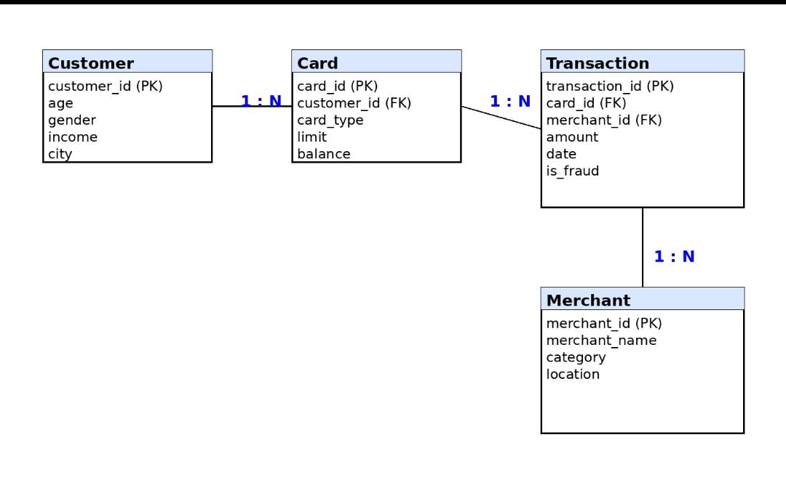

The final model has been successfully deployed and is hosted on [Render](https://credit-card-approval-prediction-oycw.onrender.com).

## 🛠 Technology Stack
The project leverages the following core technologies for data processing and model deployment:
* **Languages:** Python
* **Libraries:** Pandas, NumPy, Scikit-learn, XGBoost
* **Web Framework:** Flask
* **Deployment:** Render

---

## 📐 Entity Relationship (ER) Diagram
The ER diagram below illustrates the relationships between the various entities in our credit card approval dataset.

## Workflow

The Credit Card Approval Prediction project follows a structured machine learning workflow to predict whether a credit card application should be approved or rejected.

### Epic 1: Data Collection
**Story 1:** Download the Credit Card Approval dataset and prepare it for analysis and machine learning model development.

➡️ **Documentation:** [Epic 1 - Data Collection](data/epic1.md)

---

### Epic 2: Visualizing and Analysing the Data

**Story 1:** Import the required Python libraries for data analysis, visualization, and machine learning.

**Story 2:** Read and explore the dataset to understand its structure, features, and target variable.

**Story 3:** Perform univariate analysis to examine the distribution of individual variables.

**Story 4:** Conduct multivariate analysis to identify relationships among multiple applicant features.

**Story 5:** Perform descriptive statistical analysis to summarize key characteristics and trends in the dataset.

➡️ **Documentation:** [Epic 2 - Data Analysis](epics/epic2.md)

---

### Epic 3: Data Pre-Processing

**Story 1:** Identify and remove duplicate records.

**Story 2:** Detect and handle missing values.

**Story 3:** Perform data cleaning and preprocessing.

**Story 4:** Apply feature engineering techniques.

**Story 5:** Convert categorical variables into numerical representations.

➡️ **Documentation:** [Epic 3 - Data Preprocessing](epics/epic3.md)

---

### Epic 4: Model Building

**Story 1:** Train a Logistic Regression model.

**Story 2:** Train a Random Forest model.

**Story 3:** Train a Decision Tree model.

**Story 4:** Compare all models and select the best-performing model.

➡️ **Documentation:** [Epic 4 - Model Building](epics/epic4.md)

---

### Epic 5: Application Building

**Story 1:** Build the prediction interface.

**Story 2:** Integrate the trained model.

**Story 3:** Test the prediction workflow.

➡️ **Documentation:** [Epic 5 - Application](epics/epic5.md)
