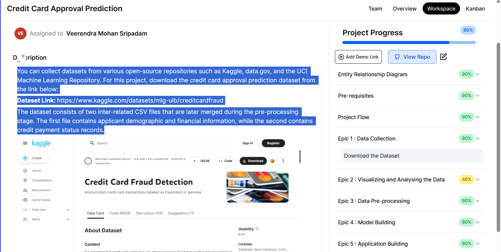

⬅️ **Back to:** [README](../README.md)

## 📖 Description

Credit Card Approval Prediction is an end-to-end Machine Learning project that predicts whether a credit card application is likely to be approved based on an applicant's demographic, financial, and credit-related information.

The objective is to assist financial institutions in making faster, more consistent, and data-driven credit approval decisions by leveraging predictive analytics. Multiple machine learning algorithms are trained and compared to identify the most effective model for this classification task.

---

## 📊 Dataset

The project uses the **Credit Card Approval Prediction** dataset from Kaggle. The dataset contains two related CSV files that are linked using a unique applicant ID. One file stores demographic and financial information about applicants, while the other contains the approval status for their credit card applications.

**Dataset:** https://www.kaggle.com/datasets/rikdifos/credit-card-approval-prediction

  

---

### Dataset Overview

