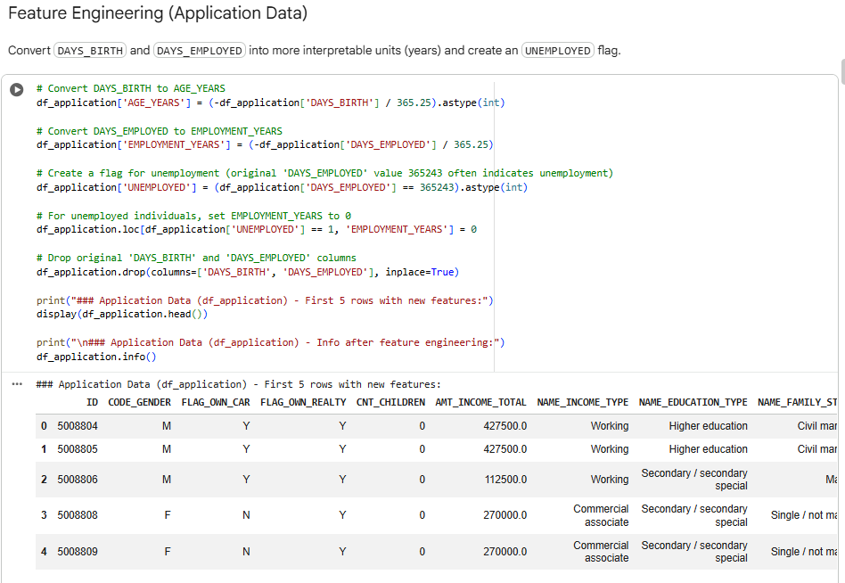
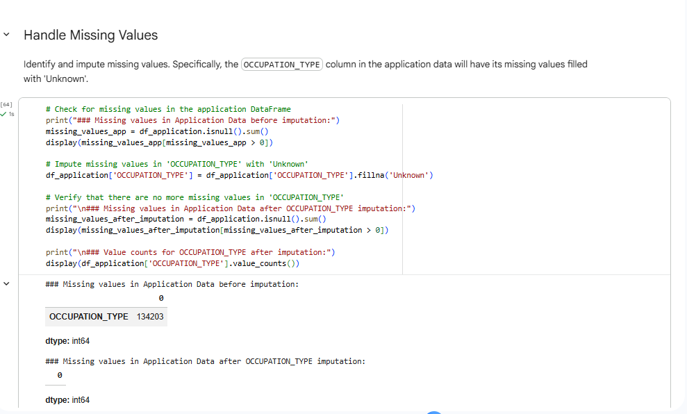

[← Back to Main Project README](../README.md)

# 📝 Epic 3: Data Preprocessing & Feature Engineering

In this phase, we perform essential data cleaning and feature engineering to prepare the raw dataset for machine learning model training.

---

## 🔍 Data Inspection & Handling Duplicates
We first inspect the dataset to identify duplicate entries and redundant records to ensure data integrity for our models.

---

## 🛠 Handling Missing Values
We identify and address missing data points (null values) to prevent bias and ensure the models receive high-quality input.

---

## ⚙️ Feature Engineering
We create new, meaningful features from the existing raw data to help the models better capture underlying patterns.

---

## 🔢 Encoding Categorical Variables
Since machine learning models require numerical input, we transform categorical variables into a format suitable for algorithmic processing.

