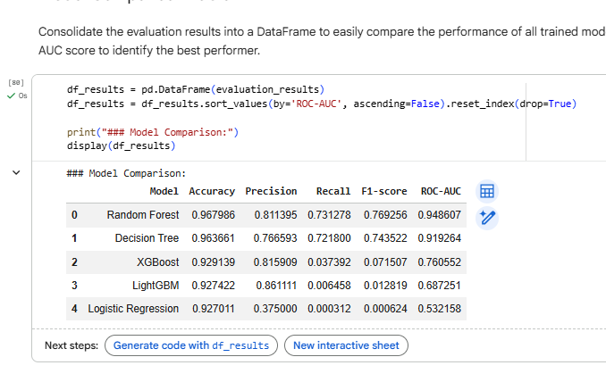
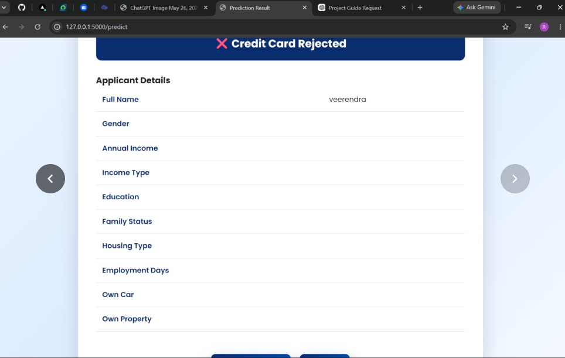

[← Back to Main Project README](../README.md)

# 🤖 Epic 4 – Model Building & Evaluation

In this phase, multiple machine learning algorithms are trained and evaluated to identify the most suitable model for predicting credit card approval.

---

## 📈 Logistic Regression
Logistic Regression serves as a baseline classification model.

---

## 🌳 Random Forest
Random Forest is an ensemble learning algorithm.

---

## 🚀 XGBoost
XGBoost is a gradient boosting algorithm that builds trees sequentially.

---

## 🌲 Decision Tree
The Decision Tree model demonstrated the best overall performance.

---

## ⚙️ Model Training Process
This chart illustrates the training phase of our selected models.

---
## 📊 Model Comparison
The performance of all three machine learning models is compared using evaluation metrics such as Accuracy, Precision, Recall, F1-Score, and ROC-AUC. 

**Model Comparison Chart:**

---

## ✅ Conclusion
Based on the comparative analysis, the **Decision Tree** model was selected for deployment.

The final model is hosted on [Render](https://credit-card-approval-prediction-oycw.onrender.com).
