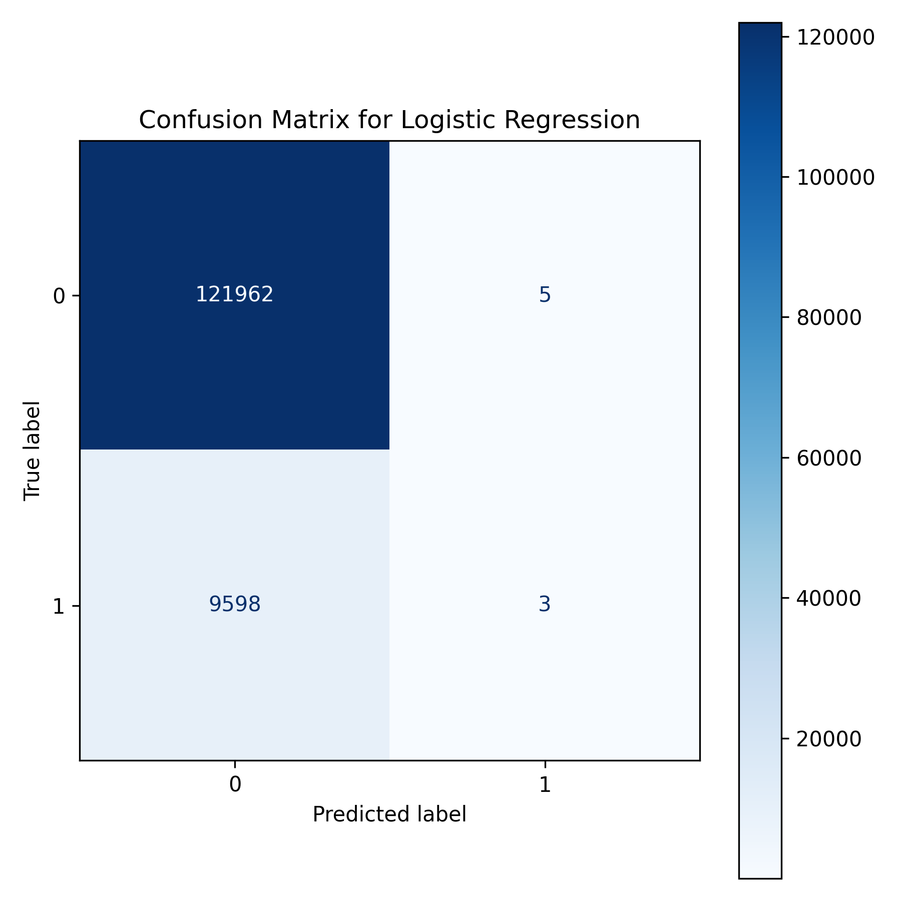
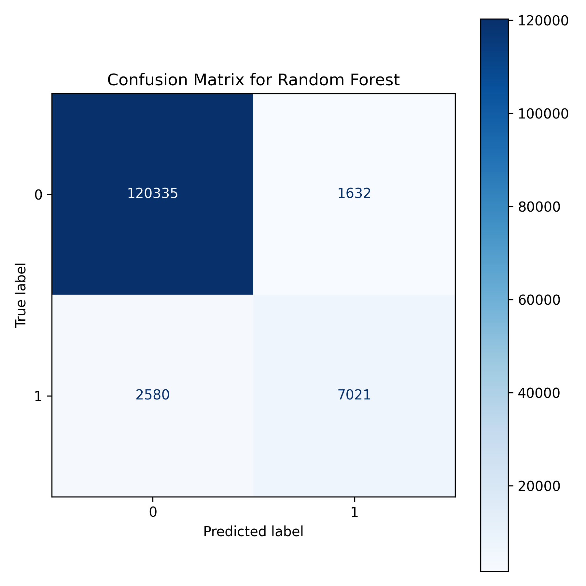
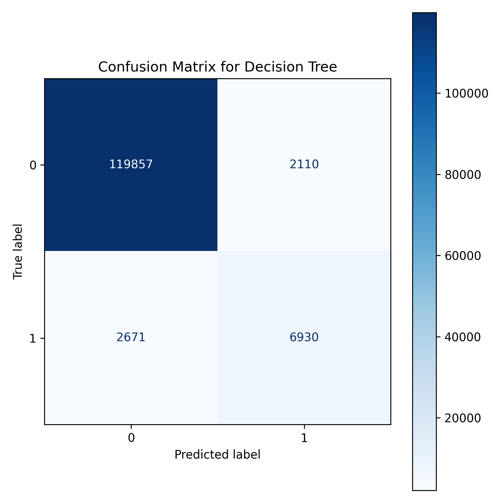

# 🤖 Epic 4: Model Building & Evaluation

In this phase, we trained and evaluated multiple machine learning algorithms to identify the most suitable model for predicting credit card approval. We compared the performance of Logistic Regression, Random Forest, and Decision Tree models.

---

## 📈 Logistic Regression
Logistic Regression was used as our baseline classification model.

---

## 🌳 Random Forest
Random Forest, an ensemble learning method, was employed to improve prediction accuracy.

---

## 🌲 Decision Tree
The Decision Tree model was trained to capture the relationships between applicant attributes and approval outcomes.

---

## ✅ Conclusion
Based on the comparative analysis of the confusion matrices and evaluation metrics, the **Decision Tree** model demonstrated the best overall performance. It effectively balanced predictive accuracy and generalization, making it the most reliable model for predicting credit card approval.
