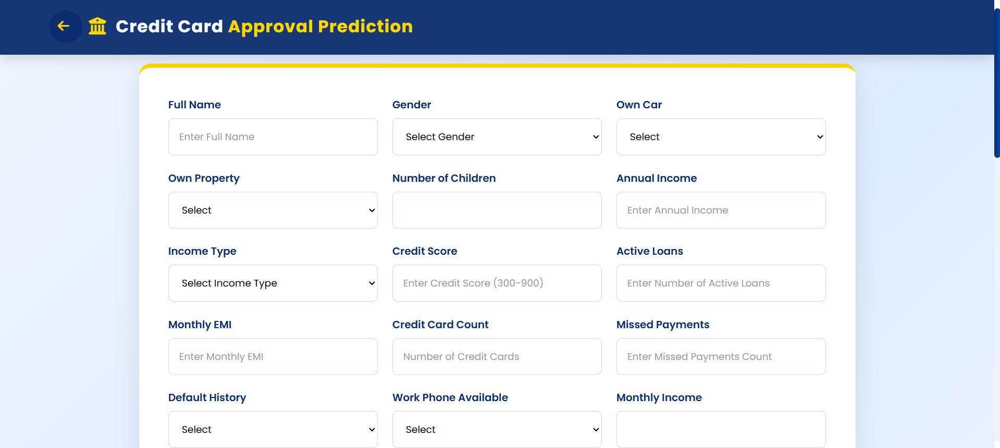
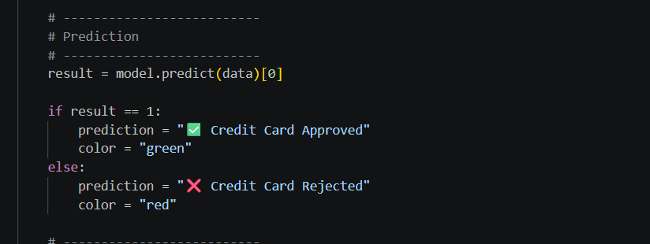

[← Back to Main Project README](../README.md)

# 🌐 Epic 5: Web Application Development & Deployment

In this phase, we developed a responsive web interface to allow users to interact with our credit card approval prediction model. The application features a clean, user-friendly design built with HTML, CSS, and JavaScript.

---

## 🖥️ Web Architecture
Our application follows a standard client-server architecture:
* **Frontend:** Built using HTML5, CSS3, and JavaScript to provide a seamless user experience.
* **Backend:** A Python-based API that processes the user inputs, runs the pre-trained Decision Tree model, and returns the approval prediction.

---

## 📋 Landing Page & User Interface
The landing page provides navigation to the application's details and the main prediction form.

---

## 📝 Prediction Form
The prediction form is designed to collect necessary applicant data, including name and identification details.
* **Input Fields:** Captures applicant data (e.g., Full Name, [Aadhaar Redacted]).
* **Validation:** Basic JavaScript validation ensures data integrity before submission.

---

## ⚙️ Backend Integration
The `API.py` file serves as the bridge between the frontend and our machine learning model. It receives the form data, performs necessary preprocessing, and executes the prediction logic.

---

## 🚀 Prediction Output
Once the form is submitted, the system processes the request and displays the final credit card approval result.

---

## ✅ Deployment
The application has been fully deployed and is accessible online for real-time credit card approval predictions.

👉 **[Access the Application](https://credit-card-approval-prediction-oycw.onrender.com)**
